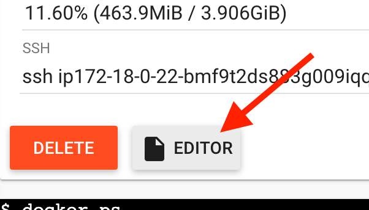
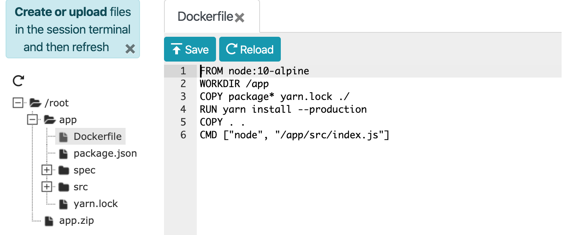

## Creación de archivos

Si usted es nuevo en una terminal Linux, no se preocupe! La forma más fácil de crear un archivo es usar el comando `touch`.

```bash
touch Dockerfile
```

Si ejecuta `ls`, verá que el archivo ha sido creado. Una vez creado, puede utilizar los siguientes consejos de **Edición de archivos**.


## Edición de archivos

En PWD, puede utilizar cualquier editor basado en CLI. Sin embargo, sabemos que mucha gente no se siente tan cómoda en el CLI. Puede hacer clic en el botón "Editor" para obtener una vista del administrador de archivos.

{: style=width:50% }
{:.text-center}

Después de hacer clic en el botón del editor, se abrirá el editor de archivos. La selección de un archivo proporcionará un editor basado en la web.

{: style=width:75% }
{: .text-center }


## Abrir una aplicación cuando la insignia se ha ido

Si ha iniciado un contenedor, pero no aparece la insignia de puerto, existe una forma de abrir la aplicación.

1. En primer lugar, valida que el contenedor se está ejecutando y que no ha fallado al arrancar. Ejecute `docker ps` y compruebe que hay una asignación de puertos en la sección `PORTS`.

    ```bash
    $ docker ps
    CONTAINER ID        IMAGE               COMMAND                  CREATED             STATUS              PORTS                    NAMES
    976e7066d705        docker-101          "docker-entrypoint.s…"   2 seconds ago       Up 1 second         0.0.0.0:3000->3000/tcp   xenodochial_ritchie
    ```
  
    Si el contenedor no se inició, revise los registros del contenedor y trate de averiguar qué podría estar pasando.

1. En PWD, busque la pantalla `SSH`. Debería tener una pantalla que se parezca a `ssh ip172....`. Copia todo DESPUÉS de la parte `ssh` (`ip172.....`).

1. Pegue eso en el navegador web, pero NO presione enter todavía. Encuentra el símbolo `@`. Sustitúyalo por `-PORT.` Por ejemplo, si yo tuviera `ip172-18-0-22-bmf9t2ds883g009iqq80@direct.labs.play-with-docker.com` y quería ver el puerto 3000, debería abrir <code>ip172-18-0-22-bmf9t2ds883g009iqq80<strong>-3000</strong>.direct.labs.play-with-docker.com</code>.

   