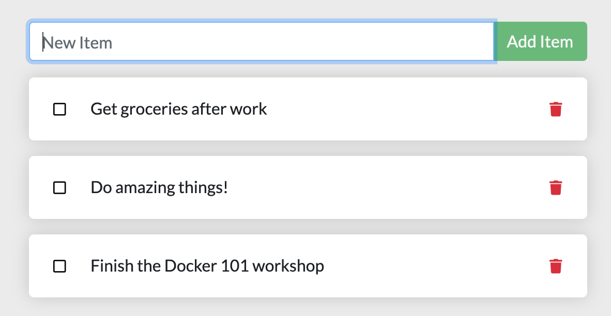

Para el resto de este tutorial, trabajaremos con un simple gestor de listas de tareas (todo list) que se está ejecutando en Node. Si no estás familiarizado con Node, ¡no te preocupes! ¡No se necesita experiencia real con JavaScript!

En este punto, su equipo de desarrollo es bastante pequeño y usted simplemente está construyendo una aplicación para probar su MVP (producto mínimo viable). Quieres mostrar cómo funciona y lo que es capaz de hacer sin necesidad de pensar en cómo funcionará para un equipo grande, múltiples desarrolladores, etc.

{: style="width:50%;" }
{ .text-center }

## Introduciendo nuestra aplicación en PWD

Antes de que podamos ejecutar la aplicación, necesitamos obtener el código fuente de la aplicación en el entorno Play with Docker. Para proyectos reales, puedes clonar el repositorio. Pero, en este caso, usted subirá un archivo ZIP.

1. [Descarga el zip](/assets/app.zip) y cárgalo a Play with Docker. Como consejo, puede arrastrar y soltar el zip (o cualquier otro archivo) sobre el terminal en PWD.

1. En el terminal PWD, extraiga el archivo zip.

   ```bash
   unzip app.zip
   ```

1. Cambie su directorio de trabajo actual a la nueva carpeta 'app'.

   ```bash
   cd app/
   ```

1. En este directorio, debería ver una aplicación simple basada en Node.

   ```bash
   ls
   package.json  spec          src           yarn.lock
   ```

## Creación de la imagen del contenedor con la aplicación

Para construir la aplicación, necesitamos usar un `Dockerfile`. Un Dockerfile es simplemente un script de instrucciones basado en texto que se utiliza para crear una imagen de contenedor. Si ya ha creado Dockerfiles anteriormente, es posible que aparezcan algunos defectos en el Dockerfile que se muestra a continuación. Pero, ¡no te preocupes! Los revisaremos.

1. Cree un archivo llamado Dockerfile con el siguiente contenido.

   ```dockerfile
   FROM node:10-alpine
   WORKDIR /app
   COPY . .
   RUN yarn install --production
   CMD ["node", "/app/src/index.js"]
   ```

1. Construya la imagen del contenedor usando el comando `docker build`.

   ```bash
   docker build -t docker-101 .
   ```

   Este comando usó el Dockerfile para construir una nueva imagen del contenedor. Puede que haya notado que se han descargado muchas "capas". Esto se debe a que instruimos al constructor que queríamos empezar desde la imagen `node:10-alpine`. Pero, como no teníamos eso en nuestra máquina, esa imagen necesitaba ser descargada.

   Después de eso, copiamos en nuestra aplicación y usamos `yarn` para instalar las dependencias de nuestra aplicación. La directiva `CMD` especifica el comando por defecto que se ejecutará al iniciar un contenedor desde esta imagen.

## Iniciando el contenedor de la aplicación

Ahora que tenemos una imagen, vamos a ejecutar la aplicación! Para ello, usaremos el comando `docker run` (¿recuerdas lo de antes?).

1. Inicie su contenedor usando el comando `docker run`:

   ```bash
   docker run -dp 3000:3000 docker-101
   ```

   ¿Recuerdas las banderas `-d` y `-p`? Estamos ejecutando el nuevo contenedor en modo "separado" (en segundo plano) y creando un mapeo entre el puerto 3000 del host y el puerto 3000 del contenedor.

1. Abra la aplicación haciendo clic en la insignia "3000" en la parte superior de la interfaz PWD. Una vez abierto, ¡debería tener una lista de cosas por hacer vacía!

   {: style="width:450px;margin-top:20px;"}
   {: .text-center }

1. Adelante, agregue uno o dos elementos y vea que funciona como usted espera. Puede marcar las posiciones como completas y eliminarlas.

En este punto, deberías tener un administrador de listas de cosas por hacer con unos cuantos elementos, ¡todos construidos por ti! Ahora, hagamos algunos cambios y aprendamos sobre el manejo de nuestros contenedores.

## Recapitulación

En esta breve sección, aprendimos lo básico sobre la construcción de una imagen de contenedor y creamos un Dockerfile para hacerlo. Una vez que construimos una imagen, iniciamos el contenedor y ¡vimos la aplicación en ejecución!

A continuación, vamos a hacer una modificación a nuestra aplicación y aprender a actualizar nuestra aplicación en ejecución con una nueva imagen. En el camino, aprenderemos algunos otros comandos útiles.
